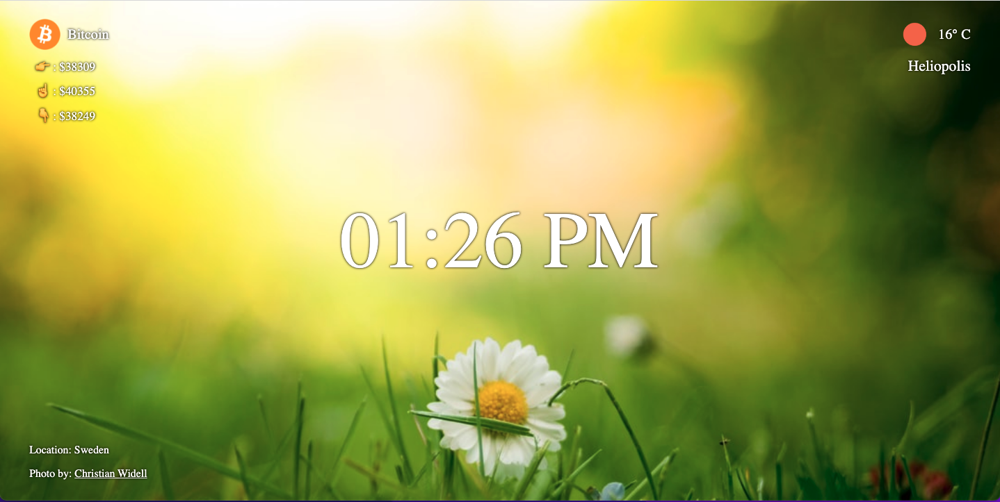

# Personal Dashboard

## About

A chrome extension replace your new tab page with a dashboard with nature background images, clock, current weather information and bitcoin prices.

To make the project functional you need to register and get your own API keys from Unsplash and OpenWeather and put them in apiKeys object in config.js file.

Thanks for :
- [Unsplash](https://unsplash.com/developers) API.
- [OpenWeather](https://openweathermap.org/api) API.
- [CoinGecko](https://www.coingecko.com/api/documentations/v3#/) API.

## Instructions

No install is needed.

## Built with

- HTML.
- CSS.
- JavaScript.
- API <https://unsplash.com/developers>.
- API <https://openweathermap.org/api>.
- API <https://www.coingecko.com/api/documentations/v3#/>.

## Preview
